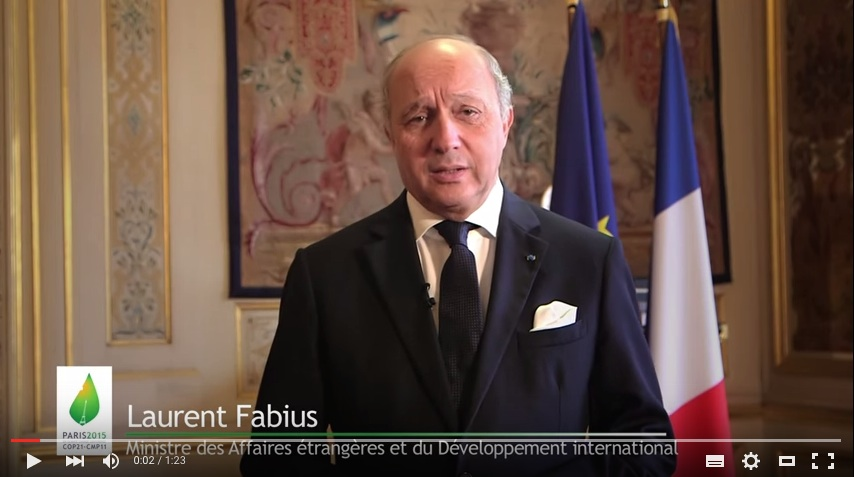

# watson-go-sdk

Simple Watson SDK for the [Go programming language](http://golang.org/).

---------------------------------------
  * [Features](#features)
  * [Requirements](#requirements)
  * [Installation](#installation)
  * [Usage](#usage)
  * [Demos](#demos)
  * [Contributors](#contributors)
  * [License](#license)

---------------------------------------
## Features

  * Lightweight
  * Native Go implementation. No C-bindings, just pure Go

So far only [Speech To Text](http://www.ibm.com/smarterplanet/us/en/ibmwatson/developercloud/speech-to-text.html) and [Text To Speech](http://www.ibm.com/smarterplanet/us/en/ibmwatson/developercloud/text-to-speech.html) functionalities have been implemented. 

---------------------------------------
## Requirements

  * Go 1.2 or higher

---------------------------------------
## Installation
- `watson-go-sdk` is available as a normal Go package with this Github branch. Just include it in your dependencies (imports) on your code:

```go
import "github.com/mediawen/watson-go-sdk"
```

- Make sure [Git is installed](http://git-scm.com/downloads) on your machine and in your system's `PATH`.

- Install the package to your [$GOPATH](http://code.google.com/p/go-wiki/wiki/GOPATH "GOPATH") with the [go tool](http://golang.org/cmd/go/ "go command") from shell:

```bash
$ go get "github.com/mediawen/watson-go-sdk"
```

---------------------------------------
## Usage

Usage of this SDK is simple.

Go to [IBM/Bluemix](https://console.ng.bluemix.net/).

Once you allocate a Watson service, from the dashboard, you can go to the service settings, and get the service credentials where you can extract username and password required to initialize this SDK :

```go
package main

import (
	"github.com/mediawen/watson-go-sdk"
)

func main() {
	w := watson.New("<username>", "<password>")
```

Replace <username> and <password> from the service credentials.

### Speech To Text

- The Speech To Text service allows you to transcribe audio data to text.
You have to specify the the language in which the audio is spoken. For each language, the service supports two models:
  - The broadband model with audio that is sampled at greater than or equal to 16 KHz.
  - The narrowband model with audio that is derived from the telephone, which is typically recorded at 8 KHz.

- Get list of models and languages:

- Model Type

    ```go
    type Model struct {
    	Rate int		// Minimum Sampling Rate
    	Name string		// Model Name
    	Lang string		// Model Language
    	Desc string		// Model Description
    }
    
    type Models struct {
    	Models []Model
    }
    ```
    
* Example

```go
package main

import (
	"fmt"
	"log"
	"github.com/mediawen/watson-go-sdk"
)

func main() {
	w := watson.New("foo", "shhhht")

	ml, err := w.GetModels()
	if err != nil {
		log.Fatal(err)
	}

	for _, m := range ml.Models {
		fmt.Printf("%s %-8d=> %s\n", m.Lang, m.Rate, m.Name)
	}
}
```

Simple isn't it ?

---------------------------------------
## Roadmap

- Add live support (through websocket)
- Fix issues reported on this repository
- Add other Watson functionalities:
  - IBM Language Translation
  - IBM Natural Language Classifier
  - IBM Concept Expansion
  - IBM Message Resonance
  - IBM Personality Insights
  - IBM Question and Answer
  - IBM Relationship Extraction
  - IBM Retrieve and Rank
  - IBM Tradeoff Analytics
  - IBM Visual Recognition

---------------------------------------
## Demos

- Text To Speech API [demo](https://speech-to-text-demo.mybluemix.net/).
- Speech To Text API [demo](https://text-to-speech-demo.mybluemix.net/).
- At [MediaWen International](http://mediawen.com), we use these technologies to enhance [STVHub](http://stvhub.com), our platform for closed captioning, subtitling, and automatic dubbing.

  By example, we generated the voice over (or Automatic Dubbing) on a video of the French Minister of Foreign Affairs anouncing the Climate Change Conference [COP21](http://www.cop21.gouv.fr/) hosted in Paris, December 2015.

  Just watch it and listen in [Spanish](https://www.youtube.com/watch?v=tF852LsSwoo) and [English](https://www.youtube.com/watch?v=8sWZMea-q2I) IBM/Watson Speech Synthesis brought to you on video by [STVHub](http://stvhub.com).



---------------------------------------
## Contributors

- [Philippe Anel](https://github.com/xigh) - CTO of Mediawen

---------------------------------------
## License

The file cookie.go has been picked from [go net/http](http://golang.org/pkg/net/http/) package. It's under the following BSD License:

    Copyright (c) 2012 The Go Authors. All rights reserved.
    
    Redistribution and use in source and binary forms, with or without
    modification, are permitted provided that the following conditions are
    met:
    
       * Redistributions of source code must retain the above copyright
    notice, this list of conditions and the following disclaimer.
       * Redistributions in binary form must reproduce the above
    copyright notice, this list of conditions and the following disclaimer
    in the documentation and/or other materials provided with the
    distribution.
       * Neither the name of Google Inc. nor the names of its
    contributors may be used to endorse or promote products derived from
    this software without specific prior written permission.
    
    THIS SOFTWARE IS PROVIDED BY THE COPYRIGHT HOLDERS AND CONTRIBUTORS
    "AS IS" AND ANY EXPRESS OR IMPLIED WARRANTIES, INCLUDING, BUT NOT
    LIMITED TO, THE IMPLIED WARRANTIES OF MERCHANTABILITY AND FITNESS FOR
    A PARTICULAR PURPOSE ARE DISCLAIMED. IN NO EVENT SHALL THE COPYRIGHT
    OWNER OR CONTRIBUTORS BE LIABLE FOR ANY DIRECT, INDIRECT, INCIDENTAL,
    SPECIAL, EXEMPLARY, OR CONSEQUENTIAL DAMAGES (INCLUDING, BUT NOT
    LIMITED TO, PROCUREMENT OF SUBSTITUTE GOODS OR SERVICES; LOSS OF USE,
    DATA, OR PROFITS; OR BUSINESS INTERRUPTION) HOWEVER CAUSED AND ON ANY
    THEORY OF LIABILITY, WHETHER IN CONTRACT, STRICT LIABILITY, OR TORT
    (INCLUDING NEGLIGENCE OR OTHERWISE) ARISING IN ANY WAY OUT OF THE USE
    OF THIS SOFTWARE, EVEN IF ADVISED OF THE POSSIBILITY OF SUCH DAMAGE.

All the rest of the code is under the the Apache License, Version 2.0 (the "License");
you may not use these files except in compliance with the License.
You may obtain a copy of the License at

    http://www.apache.org/licenses/LICENSE-2.0

Unless required by applicable law or agreed to in writing, software
distributed under the License is distributed on an "AS IS" BASIS,
WITHOUT WARRANTIES OR CONDITIONS OF ANY KIND, either express or implied.
See the License for the specific language governing permissions and
limitations under the License.
